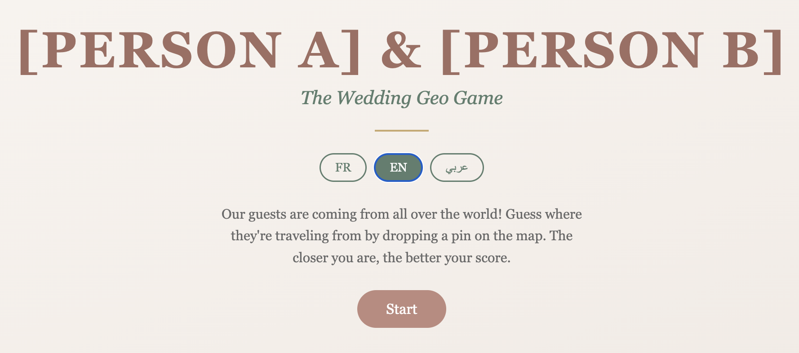
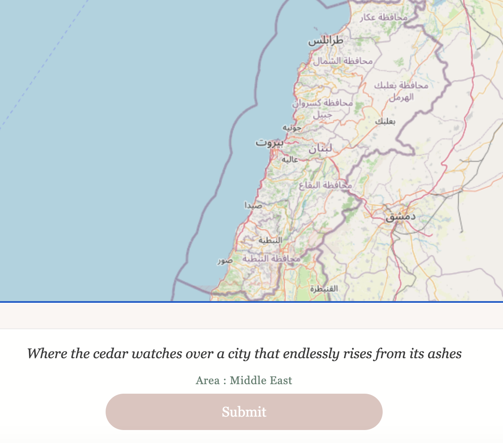
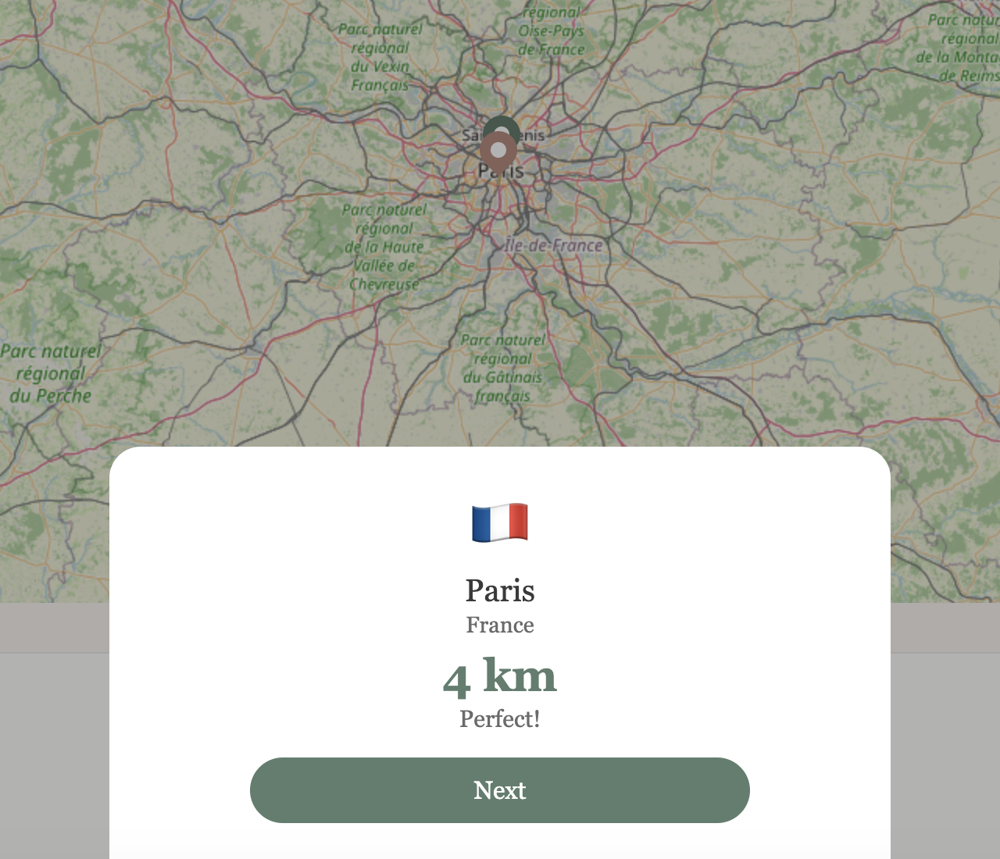

# Wedding Geography Guessing Game

A trilingual (French / English / Arabic) geography guessing game, vibe-coded for a real wedding. Guests drop pins on an interactive world map to guess where other guests are traveling from; a Haversine distance score tells them how close they got.

## Screenshots

The game flow across its three screens — welcome, guessing, result:

| 1. Welcome | 2. Guessing | 3. Result |
|---|---|---|
|  |  |  |

## Context

Built for a French–Lebanese wedding whose invitees are coming from all over the world — France, Lebanon, Palestine, Nepal, USA, the Philippines, Brazil, Côte d'Ivoire, and more. That context drives the specific feature set:

- **Trilingual UI (FR / EN / AR)** — French and English for the two family languages, Arabic (with a Lebanese dialect flavor) for guests from Lebanon and the wider region.
- **RTL layout support** — Arabic reverses the layout via `dir="rtl"` on `<html>` and matching `[dir="rtl"]` selectors in CSS.
- **Real-world guest cities as rounds** — the 19 rounds are actual places guests are coming from, which is what makes the game meaningful as a wedding activity rather than a generic trivia game.

This repo is published as a vibe-coding portfolio piece. The couple's names and any other personally-identifying information have been replaced with placeholders like `[PERSON A]` and `[PERSON B]`.

## Key design decisions

These are the portfolio-interesting choices — why the project looks the way it does.

### No build step
All code runs directly in the browser. No bundler, no transpiler, no `npm install`. The deploy loop is: edit a file, refresh the page. This keeps the project trivially deployable on any static host (no Node runtime, no build server) and removes the entire category of bundler/version/toolchain problems.

### Minimal dependencies
Only **Leaflet 1.9.4** (loaded from a CDN) and **OpenStreetMap tiles**. Zero npm packages. No framework — no React, no Vue, no Svelte. The whole app is vanilla HTML + CSS + one JS file.

### No backend
Static HTML / CSS / JS plus a single `guests.json` file. No database, no API server, no auth. The original live site runs on basic shared hosting with FTP — this architecture was chosen specifically to avoid PHP / MySQL / server-side complexity.

### Privacy by design
This app is intentionally **private by default**, and the repo treats that as a feature rather than an oversight:

- **No cookies, no analytics, no tracking** — nothing leaves the browser except Leaflet's tile requests to OpenStreetMap.
- **`noindex` meta tag + `robots.txt` that disallows all crawlers** — search engines are explicitly asked not to index the site.
- **Guest data is City / Country granularity only** — no street addresses, no personal contact info in `guests.json`.
- **Progress persists client-side only** — mid-session state (current round, running score) lives in `localStorage`; nothing is sent to a server.

For a wedding invitation, a private-by-default app is the right shape. The privacy guards are in place so the site can be shared via a direct link without ever being discoverable to the outside web.

### i18n via `data-i18n` attributes
Every translatable string in the HTML carries a `data-i18n="key"` attribute; translations live in a single `i18n` object in `game.js`. No i18n library, no JSON bundles, no async loading — you can read the translation keys directly in the HTML. Switching language updates the DOM and (for Arabic) flips the document direction to RTL.

### Mobile-first
Most guests access this from their phones during the wedding, so the layout is mobile-first. The Leaflet map is touch-driven (tap to place a pin, drag to refine), and the three-screen SPA layout scales down to phone viewports without separate breakpoints for most elements.

### Haversine formula for scoring
Distance between the guessed and actual coordinates is computed with the Haversine formula — accurate spherical distance on Earth, no external geocoding API needed, all in a few lines of JS.

## Features

- Three-screen SPA (welcome / game / results), toggled via a single `.active` class on each `<section>`.
- 19 rounds, each with a city + country + trilingual clue.
- Three languages (FR / EN / AR) with full RTL support for Arabic.
- Touch-friendly Leaflet map with OpenStreetMap tiles.
- Mid-session resume via `localStorage` — close the tab and come back.
- Final results screen with total distance, per-round breakdown, and a tier ("Geography expert!" / "Well played!" / etc.).

## Stack

- **HTML5** + **vanilla JS** + **CSS** (no build step).
- **Leaflet 1.9.4** via CDN for the map.
- **OpenStreetMap** tiles (free, no API key).
- **`guests.json`** for round data.

## File structure

```
index.html     Three-screen SPA (welcome, game, results). Includes Leaflet from CDN.
style.css      Wedding palette (rose / sage / gold), Leaflet overrides, RTL rules.
game.js        Game logic, i18n object, Leaflet setup, Haversine scoring. Single script, no modules.
guests.json    19 rounds — city, country, lat/lng, trilingual clues.
robots.txt     Disallow all — part of the privacy-by-design setup.
CLAUDE.md      Project notes for Claude Code sessions.
```

## Run locally

A static server is required (the app fetches `guests.json`, which `file://` URLs can't do):

```sh
python3 -m http.server 8000
```

Then open <http://localhost:8000>.

## Customize

- **Rounds**: edit `guests.json`. Each entry needs `id`, `city`, `country`, `lat`, `lng`, `clue`, and `hint` — the last two are objects with `fr` / `en` / `ar` keys.
- **Copy**: edit the `i18n` object at the top of `game.js` for UI strings.
- **Names**: replace the `[PERSON A]` and `[PERSON B]` placeholders in `index.html`, `game.js`, and `CLAUDE.md` with real names if forking for a real event.
- **Palette**: CSS custom properties in `:root` in `style.css` — `--rose`, `--sage`, `--gold`, and variants.

## License

MIT.

## Credits

- [Leaflet](https://leafletjs.com/) for the map.
- [OpenStreetMap](https://www.openstreetmap.org/) contributors for the tiles.
- Vibe-coded with [Claude Code](https://claude.com/claude-code).
